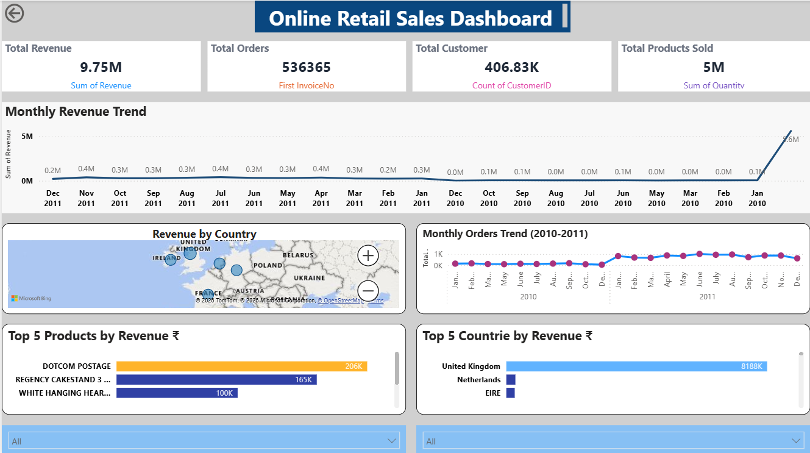

## 📊 Dashboard Preview

# 📊 E-commerce Sales Analysis Dashboard

## 🔍 Project Overview
This project analyzes e-commerce transactional data to extract business insights such as revenue trends, top customers, and product performance.

## 🛠️ Tools Used
- Python (Pandas)
- Data Cleaning & EDA
- Power BI
- Data Visualization

## 📈 Key Features
- Cleaned 500K+ rows of raw data
- Created revenue metric using Quantity × UnitPrice
- Identified top customers and high-performing products
- Built interactive Power BI dashboard

## 📊 Key Insights
- United Kingdom contributes the majority of revenue
- Customer 14646 is the highest revenue contributor
- "PAPER CRAFT, LITTLE BIRDIE" is the top-performing product
- Monthly trends show seasonal sales patterns

## 📁 Project Files
- Sample dataset (cleaned)
- Power BI dashboard (.pbix)
- Analysis outputs

## 🚀 Outcome
This project demonstrates end-to-end data analysis including data cleaning, transformation, analysis, and dashboard creation.
